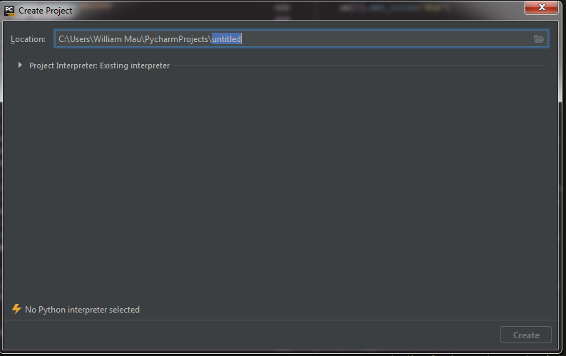
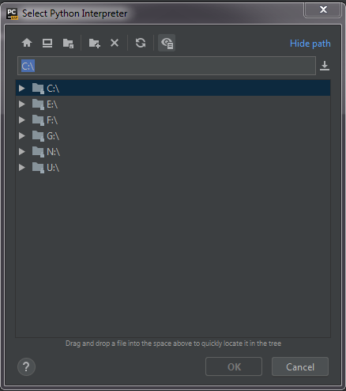

# Python for Neuroscience

Welcome to my collection of Jupyter Notebooks for learning Python in an experimental neuroscience setting. The exercises here are geared towards capable neuroscientists who have little to no programming experience, so they will do a fair amount of hand-holding but will eventually steer you towards independence. However, learning a programming language, just like learning a spoken language, is not an overnight endeavor. You should not expect to develop optimal programs when you first begin, and you should not expect to improve without self-motivated practice. The exercises in this repository are designed to provide you with a decent foundation programming, but it's up to you where you take it. 

# Installation

Python is an open source language that people all over the world contribute to. Other folks produce packages (https://realpython.com/python-modules-packages/) that others can use. This can get out of hand very quickly, so a repository called "Anaconda" was developed. If you plan to code, you will inevitably use these packages. We will download Anaconda, which is the easiest way to get Python working on your machine. 

To download Anaconda (which contains Python): https://docs.anaconda.com/anaconda/install/windows/

For Macs: https://docs.anaconda.com/anaconda/install/mac-os/

After you do this, the first thing you'll want to do is make sure your package manager, called "conda", is updated.
Windows: Open Anaconda Prompt, which you just installed. 
Mac: Open Terminal (in your Applications folder). 
For both OS, type: 
`conda update conda`

Then follow the prompts to update. It might already be up to date. 

Next, you'll want to build a "virtual environment". This is good standard practice to separate code pertaining to different projects. You'll want an environment (env, for short) for every project that you expect to use different code. conda allows us to build these envs pretty easily, and once you build it, you don't need to do this setup again. For these workshops, we will set up an env called "py36" with Python version 3.6 as the base interpreter. In Anaconda Prompt/Terminal type:

`conda create -n py36 python==3.6`

Then follow the prompts to set up the env. 

To enter your env, we "activate it" from Prompt/Terminal.

Windows: 

`conda activate py36`

Mac: 

`source activate py36`

Now we're in. You should see the word (base) to the left of your command line change to (py36). 

Inside this env, let's install some packages that we'll be working with for our exercises. Type in the follow lines to install each package. Do this individually for each package so that they all finish installing before proceeding to the next. 

`conda install -c conda-forge notebook`

`conda install -c conda-forge matplotlib`

`conda install -c conda-forge scipy`

`conda install -c conda-forge pandas`

`pip install czifile`

Okay almost there. Now we want to "clone" (https://help.github.com/en/articles/cloning-a-repository) this repository. One way to do this is with the GitHub app. Download it here: https://desktop.github.com/. Alternatively, you can simply download this repository from the green "Clone or Download" button on the top right hand corner of this page. "Download Zip" will download the contents of this repository as it is, but updating it will require you to redownload every time. 

To clone the repository, click the green "Clone or Download" button and hit "Open in Desktop". This will basically copy all the contents of my repo to your computer. Clone the repo to a directory that is easy to find (e.g., "My Documents/GitHub"). We will be searching for this directory later. 

Finally, we can launch the exercises. Back in your Prompt/Terminal (make sure you're still in py36), type: 

`jupyter notebook`

This should launch an internet browser window (e.g., Chrome) that lets you browse your computer. Navigate to the directory where you cloned the repository, open the IPython Notebooks folder, and select one of the `.ipynb` files. This should launch a notebook and now you can start coding! 

# Setting up PyCharm (IDE) 

In a later exercise, we will use an Integrated Development Environment (https://en.wikipedia.org/wiki/Integrated_development_environment). IDEs have notable advantages over Jupyter Notebooks and developing code in an IDE is very useful. Download it here: https://www.jetbrains.com/pycharm/download/#section=windows.

At the end of the installation, it will ask you to create a new project. It should get you to a window that looks something like this:

We will set up PyCharm to communicate with your existing py36 env. Follow these steps: 
(1) Rename your project to something other than "untitled". Also specify a location that is easy to find. The default is normally fine.

(2) Click the arrow next to Project Interpreter: Existing Interpreter. 

(3) Select the Existing interpreter radio button. 

(4) Click the `...` next to `<No interpreter>`.
  
(5) On the left, click Conda Environment. 

(6) Click `...`
  
You should come to a window like this, but probably with way fewer drives: 

(7) In your TERMINAL/ANACONDA PROMPT, with your py36 env activated, enter `where python` (Windows) or `which python` (Mac). This will give you your interpreter path.

(8) In the PyCharm window, navigate to that path using the folders or just copy the path to where it says `C:\`. If it's in a hidden folder, click the eye button on the top right to reveal hidden folders. 

(9) Click OK, then Create the project. 

(10) On the bottom left, click Python Console. It should open up a Terminal-like box on the bottom.

(11) Enter `import matplotlib.pyplot as plt`. If it works, you're all set. 

# Useful links:
Numpy for Matlab users: https://docs.scipy.org/doc/numpy/user/numpy-for-matlab-users.html

Numpy indexing: https://docs.scipy.org/doc/numpy-1.10.0/user/basics.indexing.html

IDEs: https://en.wikipedia.org/wiki/Integrated_development_environment

PyCharm IDE: https://www.jetbrains.com/pycharm/download/#section=windows
